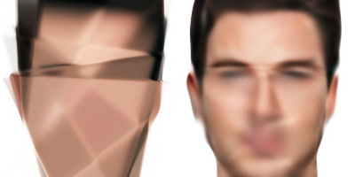
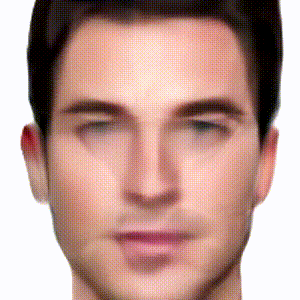
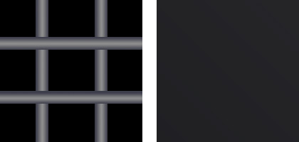
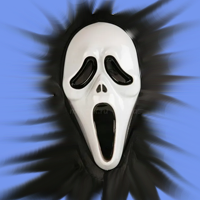
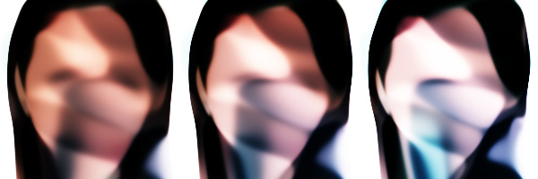

# Получение перехода от одной картинке к другой

     

### Just for FUN
Решил попробовать повторить один проект, который увидел в интернете.    
Первая нейросеть запоминает один рисунок.   
Вторая нейросеть запоминает второй рисунок.    
Затем постепенно меняем веса первой нейросети так, что бы они, за заданное количество шагов, соответствовали весам второй и каждый шаг сохраняем картинку, которую генерирует нейросеть.    
### нейросеть
Три входных нейрона. На два нейрона подаются координаты (x,y) с картинки, приведеные к диапазону от 0 до 1. Третий нейрон - нейрон смещения, на нём всегда 1.    
Два скрытых слоя. Размер определяется пользователем.    
На выходе 3 нейрона (**RGB**) определяют цвет пикселя

Вначале всё реализовал на языке **Pixilang**    
Там использовалась нейросеть, которую я написал, основываясь на книге **"Создаем нейронную сеть"** (Рашид Тарик)    
Затем, в рамках обучения, переписал всё на **Python**.   
 [Нейросеть](https://github.com/makeyourownneuralnetwork/makeyourownneuralnetwork/blob/master/part2_neural_network.ipynb) взял из книги Тарика Рашида, но добавил ещё один скрытый слой и умножение на производную убрал из коррекции весов и вставил там, где происходит определение ошибки.   
Это улучшило работу нейросети. Например, результат работы по запоминанию фотографии лица мужчины на 443 эпохе.   
Слева исходный вариант, справа - после модификации              
                        
При этом модифицированный вариант продолжал улчшать картинку, а исходный топтался на месте.

Но всё таки с этой нейросетью лучше использовать простенькие рисунки.   
Они легко и быстро запоминаются.

## Инструкция
Более подробно написано в коде.
### подбор картинок
Берём последовательность картинок, которые хотим использовать в переходе. Желательно, что бы соотношение сторон у них было одинаковым. Размер не особо важен, так как мелкие детали всё равно не заучатся, но, возможно, создадут проблемы во время обучения. Я использовал картинки 200х200 и 400х400 пиксель. 
Все картинки у меня сложенны в папке **img/**  и имеют имена типа: `номер + расширение` *(1.png  2.png 3.png ....)*  
### обучение
Для обучения используется блокнот **learn.ipynb**         
Решаю, сколько нейронов буду использовать в скрытых слоях. Я пробовал от **30** до **150**.     
Малое количество нейронов быстрее обучаются, но возможны проблемы на сложном изображении. Поэтому обучать лучше с потенциально сложных картинок.    
Все картинки, которые планируется использовать в финальной последовательности, должны быть выучены нейросетью с одним и тем же количеством нейронов в скрытых слоях.   
Веса сохраняются в папке **W-num**, где **num** - это количество используемых нейронов в скрытом слое.
Обучение прекращается *"на глазок"*, когда изображение на выходе удовлетворяет вас.     
### создание перехода   
Для этого используется блокнот **transition.ipynb**
Указываем количество нейронов в скрытом слое (в точности такое же, как и при обучении)    
Указываем размер изображений, которые хотим получить. Можно указывать размер значительно больше, чем размер исходных картинок.      
Затем прописываем последовательность переходов (*из какой картинки в какую и за сколько шагов*) и ждём результат в виде последовательности картинок в папке **result**       
Подробности расписанны в коде

## некоторые эксперименты           
Запоминание фотографий - сложная задача для подобной нейросети, но я должен был попробовать.     
На запоминание фотографии мужчины и женщины у неросети, написанной на Pixilang, ушло около 3 дней.   
Вот результат *( это анимированный GIF маленького размера на видео результат выгядит лучше)*        
            
Лица получаются со "шрамами". Видимо это связанно с тем, как нейросеть запоминает рисунок. Судя по видео перехода от лица к лицу, нейросеть запоминает фотографию в виде "лоскутов" градиента и на их границах появляются шрамы.       
Переход получился неожиданным, но интересным. Каждый раз он будет получаться по разному.    
Мне подсказали вариант, как сделать, что бы переход получился более "правильный".   
Нужно при обучении нейросети на второй фотографии взять начальные веса, обученные на первой фотографии.   
Всё получилось, как и ожидалось, но "художественной ценности" не представляет.               
           

----------------------------------

Обучение разным картинкам происходит с разной скоростью.
Некоторые простые картинки выучиваются моментально, а на некоторых нейросеть спотыкается.   
Пример картинки, которая сломала нейросеть    
(слева картинка, справа выход нейросети после длительного обучения)         
             
Картинка есть в примерах под номером 9     

А вот эту картинку нейросеть запомнила только после того, как я в фотошопе размазал края в виде шипов        

Кажется, нейросеть любит градиенты и боится чётких граней.       
Теперь у нас есть понимание, как их победить :))

---------------------------------

Если при изменении весов, когда пришли к весам из второй сети, не останавливаться и продолжить изменять веса дальше, может получится интересный результат.        
То, во что превратилось изображение женщины

